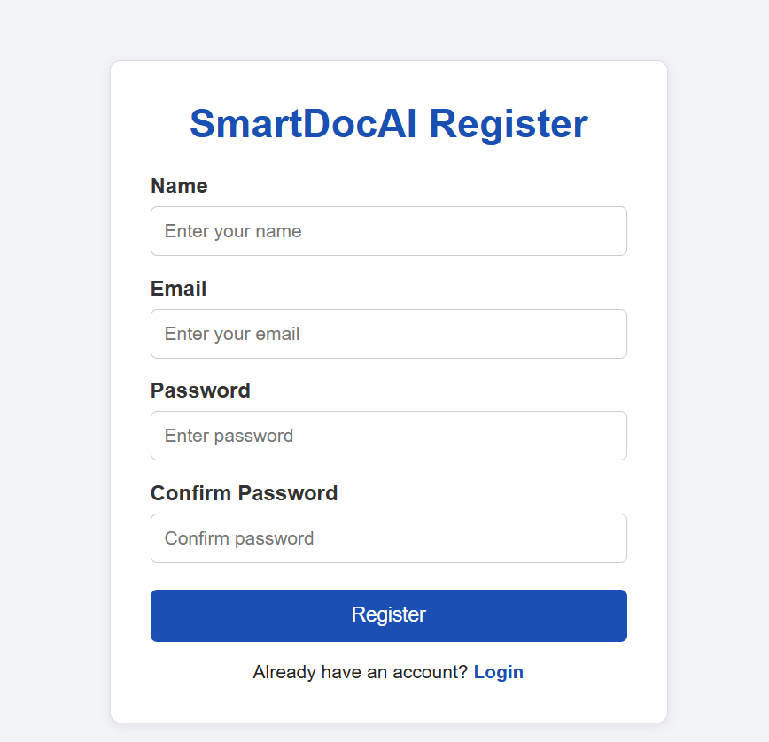
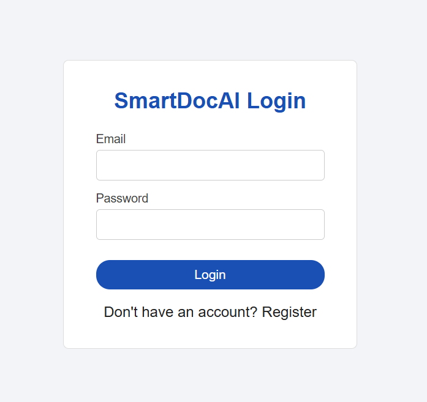
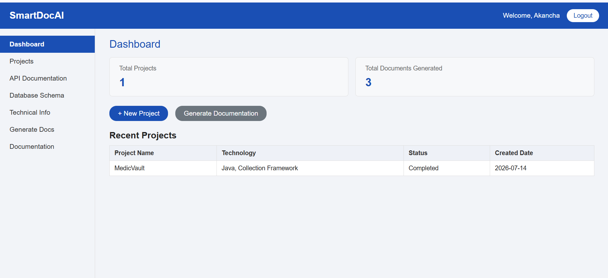
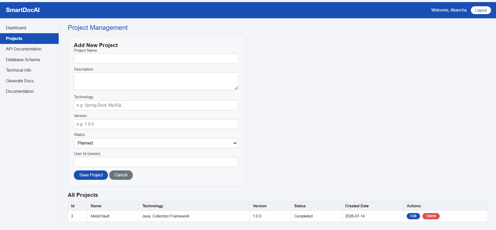
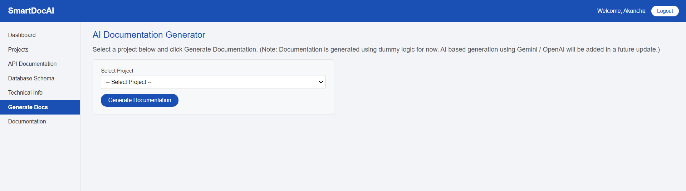

# 📄 SmartDocAI – Technical Documentation Management System

SmartDocAI is a Spring Boot based web application that helps developers manage software projects and generate technical documentation. It provides a simple dashboard to create projects, manage technical information, generate API documentation, and export project documentation.

---

## 🚀 Features

- User Registration & Login
- Secure Authentication
- Dashboard with Project Statistics
- Project Management (CRUD Operations)
- API Documentation Management
- Database Schema Management
- Technical Information Management
- AI Documentation Generation (Dummy Logic)
- PDF Export Support
- Global Exception Handling
- Input Validation using DTO
- REST APIs
- Responsive User Interface

---

## 🛠️ Technologies Used

### Backend
- Java 21
- Spring Boot
- Spring MVC
- Spring Data JPA
- Hibernate
- Maven

### Frontend
- HTML5
- CSS3
- JavaScript

### Database
- MySQL

### Tools
- IntelliJ IDEA
- Git
- GitHub
- Postman

---

# 🏗️ Project Architecture

```
Controller
     ↓
Service
     ↓
Repository
     ↓
Database
```

The project follows the layered architecture using:

- Controller Layer
- Service Layer
- Repository Layer
- DTO Layer
- Exception Handling Layer
- Entity Layer

---

# 📂 Project Structure

```
SmartDocAI
│
├── src
│   ├── main
│   │   ├── java
│   │   │   ├── controller
│   │   │   ├── dto
│   │   │   ├── entity
│   │   │   ├── exception
│   │   │   ├── repository
│   │   │   ├── service
│   │   │   ├── util
│   │   │   └── image
│   │   │       ├── dashboard.png
│   │   │       ├── login.png
│   │   │       ├── signup.png
│   │   │       ├── project.png
│   │   │       └── generate.png
│   │
│   ├── resources
│   │   ├── static
│   │   └── templates
│
├── pom.xml
└── README.md
```

---

# ⚙️ Modules

## 👤 User Module

- User Registration
- User Login
- Authentication

---

## 📁 Project Module

- Create Project
- Update Project
- Delete Project
- View All Projects

---

## 📘 API Documentation Module

Stores API related information of a software project.

---

## 🗄 Database Schema Module

Stores database table information for documentation.

---

## 💻 Technical Information Module

Stores project technology stack and technical details.

---

## 🤖 Documentation Generation Module

Generates technical documentation automatically using predefined templates.

(Currently implemented using dummy logic. AI integration can be added later.)

---

# 📸 Screenshots

## Registration Page



---

## Login Page



---

## Dashboard



---

## Project Management



---

## Documentation Generation



---

# 🗃️ Database

MySQL is used for storing:

- Users
- Projects
- API Details
- Database Schema
- Technical Information
- Generated Documents

---

# 📦 REST APIs

### User APIs

- Register User
- Login User
- Get User
- Update User
- Delete User

### Project APIs

- Create Project
- Get Project
- Update Project
- Delete Project

### API Documentation APIs

CRUD Operations

### Database Schema APIs

CRUD Operations

### Technical Information APIs

CRUD Operations

---

# 🛡 Exception Handling

Global Exception Handler is implemented using:

- @ControllerAdvice
- @ExceptionHandler

Custom exceptions include:

- UserNotFoundException
- ProjectNotFoundException
- InvalidCredentialsException

---

# ✔ Validation

Validation is implemented using:

- @NotBlank
- @Email
- @Size

DTO classes are used to validate user input.

---

# Future Enhancements

- OpenAI Integration
- Gemini API Integration
- JWT Authentication
- Role Based Authentication
- Email Verification
- Swagger/OpenAPI Documentation
- Download Documentation as PDF
- Cloud Deployment
- Docker Support

---

# ▶️ How to Run

### Clone Repository

```bash
git clone https://github.com/AkanchaRani/SmartDocAI.git
```

### Move to Project

```bash
cd SmartDocAI
```

### Configure Database

Update your MySQL username and password in:

```
application.properties
```

Example:

```properties
spring.datasource.url=jdbc:mysql://localhost:3306/smartdocai
spring.datasource.username=root
spring.datasource.password=your_password
```

### Build Project

```bash
mvn clean install
```

### Run Application

```bash
mvn spring-boot:run
```

Application will run on:

```
http://localhost:8080
```

---

# 👩‍💻 Developer

**Akancha Rani**

MCA Student

Lovely Professional University

GitHub:

https://github.com/AkanchaRani

---

# 📄 License

This project is developed for educational and learning purposes.

---

⭐ If you found this project useful, don't forget to Star this repository.
